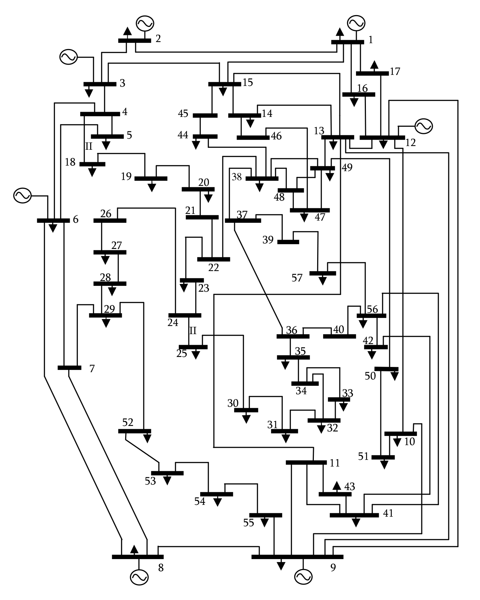

# INDENG 162 - Linear Programming & Network Flows
## Course Project - IEEE 57-Bus System Energy Allocation
*UC Berkeley, Fall 2023, Professor Lavaei*

The main goal of the project was to allocate power from each of the seven generators to the 42 load buses throughout the system.
There were costs associated with power from a given generator, limits on power that could travel through each cable, and limits on
power that could pass through any given bus. Sensitivity analysis and dual solutions are also included. Because some coefficients are
randomly generated, some initial conditions were infeasible. By default a feasible initial state has been selected. Everything has
been provided via the csv and jupyter notebook files. 

Below is the instructor's website:
[https://lavaei.ieor.berkeley.edu/Course.html](https://lavaei.ieor.berkeley.edu/Course.html)
